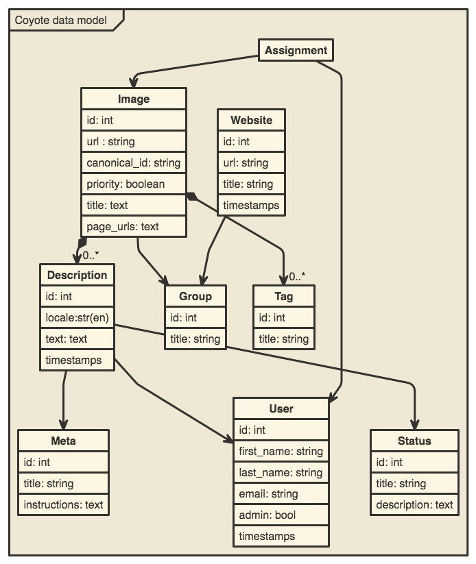

COYOTE
====

[](https://travis-ci.org/coyote-team/coyote)
[](https://codeclimate.com/github/coyote-team/coyote)
[](https://codeclimate.com/github/coyote-team/coyote/coverage)


Image annotation site and API to enable the distributed annotation of museum images built on RubyOnRails with MySQL (via MariaDB). 

- [Coyote Repo](http://github.com/coyote-team/coyote)
- [Coyote.pics](https://coyote.pics/)
- [Museum of Contemporary Art Chicago's Coyote](http://coyote.mcachicago.org)

## Setup

```bash
bundle install

#set up the .env, override at .env.development and .env.test if needed

#create the DBs for dev and test
bin/rake db:create db:migrate db:seed
RAILS_ENV=test bin/rake db:create db:migrate
```

Secure creds are kept untracked in `.env`

## Deploy

```bash
bundle exec cap production deploy
```

## Usage 

```bash
#run the server
bin/rails s

#automatically run tests as you work
#you might need to install a shim for guard
guard

#run the tests on their own
bin/rspec

#run the console
bin/rails c
```

## Vagrant Setup

Install [vagrant](https://www.vagrantup.com/downloads.html) and run `vagrant up`  Then, you can view the site like so:

```bash
vagrant up
ssh -N -L 3000:localhost:3000 vagrant@localhost -p 2222 #vagrant is the password
open http://localhost:3000
```

## Server Setup

Assuming a recent Ubuntu distribution...

```bash
sudo add-apt-repository 'deb http://nyc2.mirrors.digitalocean.com/mariadb/repo/10.0/ubuntu trusty main'
sudo apt-get update
sudo apt-get install -y software-properties-common graphviz git libpq-dev gawk build-essential libreadline6-dev zlib1g-dev libssl-dev libyaml-dev autoconf libgdbm-dev libncurses5-dev automake libtool bison pkg-config libffi-dev mariadb-server libmariadbclient-dev git make gcc  zlib1g-dev  libssl-dev libreadline6-dev libxml2-dev libsqlite3-dev nginx openssl libreadline6 libreadline6-dev curl git-core zlib1g libyaml-dev libsqlite3-dev sqlite3 libxml2-dev libxslt-dev autoconf libc6-dev libgdbm-dev ncurses-dev automake libtool pkg-config libffi-dev libv8-dev  imagemagick libmagickwand-dev fail2ban ruby-mysql 

sudo apt-get upgrade -y
git clone git://github.com/sstephenson/rbenv.git ~/.rbenv
echo 'export PATH="$HOME/.rbenv/bin:$PATH"' >> ~/.bash_profile
echo 'eval "$(rbenv init -)"' >> ~/.bash_profile
source ~/.bash_profile
git clone git://github.com/sstephenson/ruby-build.git ~/.rbenv/plugins/ruby-build
echo 'export PATH="$HOME/.rbenv/plugins/ruby-build/bin:$PATH"' >> ~/.bash_profile
source ~/.bash_profile

rbenv install -v 2.3.1
rbenv global 2.3.1
echo "gem: --no-document" > ~/.gemrc

gem install bundler

# edit config/thin.production.yml
# edit config/nginx.site.conf 
# then copy or link to your /etc/nginx/sites-available
# enable it

# finish mysql setup


# then locally edit your config/deploy/production.rb
# and edit your config/deploy.rb

# then deploy
bundle exec cap production deploy
```

## Components

- [RubyOnRails](http://rubyonrails.org/)
- [accecess](http://lukyvj.github.io/accecss/)
- [MariaDB](https://mariadb.org/) 
- [rbenv](http://rbenv.org/) with [plugins](https://github.com/sstephenson/rbenv/wiki/Plugins) for gems, bundler, build, and binstubs
- [bundler](http://bundler.io/)
- [SASS](http://sass-lang.com/)
- [Coffeescript](http://coffeescript.org/)

##Data model



For use on [nomnoml](http://www.nomnoml.com/)

```
[<frame>Coyote data model|
  [User | id: int | first_name: string | last_name: string |  email: string | admin: bool | timestamps]
  [Image | id: int |url : string | canonical_id: string | priority: boolean | title: text | page_urls: text]
  [Tag | id: int | title: string]
  [Group | id: int | title: string]
  [Description | id: int | locale:str(en) | text: text | timestamps]
  [Website | id: int | url: string | title: string | timestamps]
  [Status | id: int | title: string | description: text]
  [Meta| id: int| title: string | instructions: text]

  [Website]->[Group]

  [Image]->[Group]

  [Assignment]->[Image]
  [Assignment]->[User]

  [Description]->[User]
  [Description]->[Meta]
  [Description]->[Status]

  [Image] +-> 0..* [Description]
  [Image] +-> 0..* [Tag]
]
```

 
## Links

- [MCA Coyote Repo](https://github.com/mcachicago/coyote)
- [Museum of Contemporary Art Chicago](http://www2.mcachicago.org/) 
- [A11Y Guidelines](http://a11yproject.com/)
- [Sina's Links on Accessibility](http://www.sinabahram.com/resources.php)
- [ARIA in HTML](http://rawgit.com/w3c/aria-in-html/master/index.html) and [ARIA](http://www.w3.org/TR/wai-aria/states_and_properties#global_states)

## Versus
- [Depict4](http://depictfor.us/)
- [Autotune](https://github.com/voxmedia/autotune/)

## License
[MPLv2](http://choosealicense.com/licenses/mpl-2.0/#)
