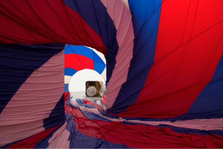

# Coyote

[![Build Status][travis-badge]][travis]

An open source image annotation app enabling the distributed annotation and comprehensive representation of images. Long descriptions can range from one sentence to several paragraphs. The software was developed by the [Museum of Contemporary Art Chicago](https://mcachicago.org/) to support a distributed workflow for describing their images and publishing those descriptions to the web. 

## Example

An image like this would traditionally be described by [alt text](https://en.wikipedia.org/wiki/Alt_attribute) like <q>A red, white, and blue fabric canopy presses against walls of room; portable fans blow air into the room through a doorway.</q>: 



*Kris Martin, Belgian, b. 1972. T.Y.F.F.S.H., 2011. Collection: Museum of Contemporary Art. Photo: Nathan Keay, © MCA Chicago.*

Coyote aims to provide more comprehensive representations:

> This is an installation that viewers are invited to walk inside of. From this viewpoint you are looking through a doorway at a slight distance, as if standing inside of a large cave and looking out of its narrow entrance at the world outside. 
> The walls of this cave are alternating stripes of red, white, and blue material that seems to be made of some kind of thin fabric. These colored stripes spiral around toward the entrance, as if being sucked out of the opening. 
> The inside of the cave is more shadowed and the area outside is brightly lit. Gradually you notice that there are in fact two openings lined up in front of each other, straight ahead of you: the first one is a tall rectangle—the red, white and blue 
> fabric is wrapped through the edges of a standard doorway; beyond that it continues to spiral around toward another circular opening. The center of this circle is much brighter, as if one had finally escape from the cave. 
> At the center of that circular opening you see two large white fans facing your direction, blowing air into the cave-like opening. Beyond the fans you see a brown, square form, which is the bottom of a huge wicker basket. 
> This basket, lying on its side, helps to reveal the truth about what you are seeing: You are standing inside of a huge hot air balloon, which is lying on its side. Blown by the fans, the fabric billows out to press out against the existing w
> alls of a large room, the malleable shape of the balloon conforming to the rectangular surfaces of an existing building–the gallery that contains it.

More information about image description projects at the MCA and elsewhere is available at [coyote.pics](http://coyote.pics), along with contact information for the project team. You can also view or hear image descriptions on the [MCA website](http://mcachicago.org).

## Table of contents

- [Developer Setup](#developer-setup)
- [Documentation](#documentation)
- [API](#api)
- [Strategies](#strategies)
- [Data Model](#data-model)
- [Links](#links)
- [Contributors](#contributors)
- [License](#license)

## <a name="developer-setup"></a>Developer Setup 

_Beginning Developers_

The app can run in a self-contained Docker container, which you can use for development. For more details see [local development with Docker Compose](https://devcenter.heroku.com/articles/local-development-with-docker-compose).

1) Install [Docker Community Edition](https://www.docker.com/get-docker)

2) Run the following commands:

```bash
git clone https://github.com/coyote-team/coyote.git
cd coyote
docker-compose build   # downloads images, builds containers
docker-compose up      # start running containers
docker-compose up test # run the test suite
docker-compose exec web bin/rake db:setup db:migrate db:seed                    # prepare database, add seed data
docker-compose exec web bin/rake coyote:admin:create[user@example.com,password] # create initial user
```

3) Open `http://localhost:3000` in your browser.

Once the app is running you can interact with it using commands like this:

```bash
docker ps                                   # list running containers
docker-compose build                        # rebuild web container when new gems are installed
docker-compose exec web pumactl restart     # restart Puma
docker-compose exec web bin/rails console   # access Rails console
docker-compose exec web bin/rake db:migrate # update the Postgres server managed by Docker
```

_Experienced Developers_

The app can also run in your local development environment, but requires a bit more know-how.

1) [Install Postgres](https://www.postgresql.org/) (on MacOS try [Postgres.app](http://postgresapp.com/)).

2) Run the following commands:

```bash
git clone https://github.com/coyote-team/coyote.git
cd coyote
bin/setup
bin/rails server && open http://localhost:3000
```

The [seed script](https://github.com/coyote-team/coyote/blob/master/db/seeds.rb) builds a simple user, so you can login as `admin@example.com`.

We have setup a `Guardfile` to speed up development. Try `bundle exec guard`.

_Testing Mailers in Development Mode_

The settings in [sample.env] work with [mailcatcher](https://mailcatcher.me/):

```bash
gem install mailcatcher     # runs independently of the app, so this gem is not part of our Gemfile
mailcatcher -f              # much better to run this in foreground vs. the default daemon mode
open http://127.0.0.1:1080/ # mail delivery console
```

_Re-seeding the Database_

You can regenerate development environment data by running `bundle exec rake dev_only:reseed`.

## <a name="documentation"></a>Documentation

YARD documentation is hosted at [coyote-team.github.io](https://coyote-team.github.io/coyote/).

Fresh documentation can be generated locally by running `bundle exec rake coyote:docs OUT=docs/apipie`. The `OUT` parameter is for `apipie`.

Coyote design refinements are documented in [design_refinements.pdf](doc_assets/design_refinements.pdf).

## <a name="api"></a> API

Coyote's API is based on the [JSON API standard](http://jsonapi.org/). Coyote-specific JSON API documentation is generated by 
[apipie](https://github.com/Apipie/apipie-rails) and can be viewed [here](apipie).

## <a name="strategies"></a> Strategies

We can extend the functionality of Coyote to better integrate with your particular CMS with a strategy file. For an example, check out [/lib/coyote/strategies/mca.rb](https://github.com/coyote-team/coyote/blob/master/lib/coyote/strategies/mca.rb).

## <a name="links"></a> Links

- [Coyote.pics](https://coyote.pics/)
- [Museum of Contemporary Art Chicago](http://www.mcachicago.org/) 

More info regarding accessibility:

- [A11Y Guidelines](http://a11yproject.com/)
- [Sina's Links on Accessibility](http://www.sinabahram.com/resources.php)
- [ARIA in HTML](http://rawgit.com/w3c/aria-in-html/master/index.html) and [ARIA](http://www.w3.org/TR/wai-aria/states_and_properties#global_states)
- [ABS's Guidelines for Verbal Description](http://www.artbeyondsight.org/handbook/acs-guidelines.shtml)

## <a name="contributors"></a> Contributors

- Tobey Albright, [MCA Chicago](https://mcachicago.org) - graphic design
- Sina Bahram, [Prime Access Consulting](https://pac.bz/) - concept and direction
- Susan Chun, [MCA Chicago](https://mcachicago.org) - project management
- Anna Lavatelli, [MCA Chicago](https://mcachicago.org) - project management
- Christopher Reed, [SEEREAD.info](http://seeread.info) - development
- Mike Subelsky, [subelsky.com](http://subelsky.com) - development

## <a name="license"></a> License

[MPLv2](http://choosealicense.com/licenses/mpl-2.0/#)

[travis-badge]: http://img.shields.io/travis/coyote-team/coyote/master.svg
[travis]: http://travis-ci.org/coyote-team/coyote
