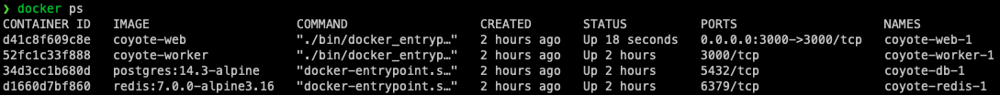

# Coyote

[![Build Status][travis-badge]][travis]

An open source image annotation app enabling the distributed annotation and comprehensive representation of images. Long descriptions can range from one sentence to several paragraphs. The software was developed by the [Museum of Contemporary Art Chicago](https://mcachicago.org/) to support a distributed workflow for describing their images and publishing those descriptions to the web.

## Example

An image like this would traditionally be described by [alt text](https://en.wikipedia.org/wiki/Alt_attribute) like <q>A red, white, and blue fabric canopy presses against walls of room; portable fans blow air into the room through a doorway.</q>:


*Kris Martin, Belgian, b. 1972. T.Y.F.F.S.H., 2011. Collection: Museum of Contemporary Art. Photo: Nathan Keay, © MCA Chicago.*

Coyote aims to provide more comprehensive representations:

> This is an installation that viewers are invited to walk inside of. From this viewpoint you are looking through a doorway at a slight distance, as if standing inside of a large cave and looking out of its narrow entrance at the world outside.
> The walls of this cave are alternating stripes of red, white, and blue material that seems to be made of some kind of thin fabric. These colored stripes spiral around toward the entrance, as if being sucked out of the opening.
> The inside of the cave is more shadowed and the area outside is brightly lit. Gradually you notice that there are in fact two openings lined up in front of each other, straight ahead of you: the first one is a tall rectangle—the red, white and blue
> fabric is wrapped through the edges of a standard doorway; beyond that it continues to spiral around toward another circular opening. The center of this circle is much brighter, as if one had finally escape from the cave.
> At the center of that circular opening you see two large white fans facing your direction, blowing air into the cave-like opening. Beyond the fans you see a brown, square form, which is the bottom of a huge wicker basket.
> This basket, lying on its side, helps to reveal the truth about what you are seeing: You are standing inside of a huge hot air balloon, which is lying on its side. Blown by the fans, the fabric billows out to press out against the existing w
> alls of a large room, the malleable shape of the balloon conforming to the rectangular surfaces of an existing building–the gallery that contains it.

More information about image description projects at the MCA and elsewhere is available at [coyote.pics](http://coyote.pics), along with contact information for the project team. You can also view or hear image descriptions on the [MCA website](http://mcachicago.org).

## Table of contents

- [Developer Setup](#developer-setup-anchor)
- [Development Workflow](#development-workflow-anchor)
- [Documentation](#documentation-anchor)
- [API](#api-anchor)
- [Data Model](#data-model-anchor)
- [Links](#links-anchor)
- [Contributors](#contributors-anchor)
- [License](#license-anchor)

## <a name="developer-setup-anchor"></a>Developer Setup

### Set up the Docker environment

The app runs in a self-contained Docker environment, which you can use for development. For more details see [local development with Docker Compose](https://devcenter.heroku.com/articles/local-development-with-docker-compose).

**Using Docker ensures the environment you develop in very closely matches the environment to which we deploy!** Please use it for local development - it is set up to be as painless as possible.

Follow these steps:

```bash
git clone https://github.com/coyote-team/coyote.git
cd coyote
docker-compose build             # first, build images and containers
docker-compose run web bin/setup # set up the environment for development
docker-compose up web            # start the web app in development
docker-compose up test           # run the test suite
```

That's it! It's really that simple. You should be able to visit [http://localhost:3000/](http://localhost:3000) to see the app, and the tests should run (and pass). The [seed script](https://github.com/coyote-team/coyote/blob/master/db/seeds.rb) builds a simple user, so you can login as `admin@example.com`.

Once the app is running you can interact with it using commands like this:

```bash
docker ps                                    # list running containers
docker-compose exec web pumactl restart      # restart Puma
docker-compose exec web bin/rails console    # access Rails console
docker-compose exec web bin/rails db:migrate # update the Postgres server managed by Docker
```

#### Error starting userland proxy: listen tcp 0.0.0.0:5432: bind: address already in use

If you encounter an error starting Docker processes like the above, you may have your own version of Postgres running in the background. You'll need to stop it in an environment-appropriate way, e.g. `sudo service postgresql stop` on Linux or `brew services stop postgresql` on Mac OS.

#### Using Pry Gem

If you want to stop execution while in the development enviroment by placing a <code>binding.pry</code> you can use the following commands:

1. Start the web app in development `docker-compose up web`
2. In a different terminal window list the running containers `docker ps`

*Screenshot output of the docker ps command*
3. Copy the container id for the coyote-web image. Ex: "d41c8f609c8e"
4. Attach to the container `docker attach d41c8f609c8e`
  - Note this will appear blank as if nothing is happening

Now when the binding.pry is hit, you can interact with the terminal as you normally would

### Configuring secure credentials

The app uses [Rails secure credentials](https://edgeguides.rubyonrails.org/security.html#custom-credentials) with sane development-time defaults. This allows us to ship Dockerized versions of the app with zero configuration, for both development and production.

**If you are deploying this application yourself,** you will want to use your own production credentials. You can find an example configuration in `config/credentials.yml.example`. To deploy your own version of Coyote, you will want to:

1. Copy the example credentials file (e.g. `pbcopy < config/credentials.yml.example`)
2. Remove the existing production credentials: `rm config/credentials/production*`
3. Generate your own production credentials: `rails credentials:edit --environment production`
4. Paste in the example credentials you copied in step 1, and overwrite their values to more useful stuff

### Testing Mailers in Development Mode

We use [Federal Offense](https://github.com/flipsasser/federal_offense) to preview development emails. It will intercept any messages you send in development. You can preview them at [http://localhost:3000/deliveries](http://localhost:3000/deliveries).

### Re-seeding the Database

You can regenerate development environment data by running `bundle exec rake dev_only:reseed`.

### Asynchronous Workers

Coyote uses Sidekiq to process jobs. This prevents the request/response cycle from blocking.

`docker-compose` will ensure the Sidekiq worker is running, but you can also run it manually:

```
bundle exec sidekiq
```

## <a name="development-workflow-anchor"></a>Development Workflow

### Topic Branches & Review Apps

We use a modified "git flow" workflow for our development process. It's very important you follow the process outlined below!

1. Create a topic branch off of master related to your work, typically something like

   ```bash
   git checkout master
   git checkout -b {name}/{issue-numer}-{description} # (e.g.) `flip/208-fix-dev-workflow
   ```

2. Write your code and then run tests locally (`rspec`) 
3. Once the tests have passed, create a pull request ("PR") and request a review from one or more team members _who aren't you_

### Deploying to a DigitalOcean Droplet

Coyote on DigitalOcean runs inside Docker.
Staging and production Docker compose configuration is defined in `docker-compose-production.yml`.
To run the application, certain environment variables need to be set.

[Environment variables are defined within an .env file](https://docs.docker.com/compose/environment-variables/#the-env-file):

```ini
APPSIGNAL_APP_ENV=
STAGING=
RAILS_ENV=
RAILS_LOG_TO_STDOUT=
RAILS_MIN_THREADS=
RAILS_MAX_THREADS=
WEB_CONCURRENCY=
RAILS_BASE_KEY=
RAILS_MASTER_KEY=
RAILS_STAGING_KEY=
MAILER_PASSWORD=
```
* `APPSIGNAL_APP_ENV`: The environment for which [AppSignal](https://www.appsignal.com) metrics are collected;
* `STAGING` (optional): defines whether it's a staging instance (which loads additional configuration);
* `RAILS_ENV`: the environment which Rails runs in. `production` when running in production or staging, otherwise `development`;
* `RAILS_LOG_TO_STDOUT`: usually `true`. Whether to log to stdout instead of a file;
* `RAILS_MIN_THREADS`: how many threads Puma should run at minimum;
* `RAILS_MIN_THREADS`: how many threads Puma should run at maximum;
* `WEB_CONCURRENCY`: how many concurrent workers Puma should run;
* `RAILS_BASE_KEY`: the [encrypted credentials](https://edgeguides.rubyonrails.org/security.html#custom-credentials) key for `config/credentials.yml.enc`;
* `RAILS_STAGING_KEY` (only when `STAGING=1`): the [encrypted credentials](https://edgeguides.rubyonrails.org/security.html#custom-credentials) key for `config/credentials/staging.yml.enc`;  
* `RAILS_MASTER_KEY`: the [encrypted credentials](https://edgeguides.rubyonrails.org/security.html#custom-credentials) key for `config/credentials/production.yml.enc`; and
* `MAILER_PASSWORD` (optional) can be used to override the password for `Rails::ActionMailer`.

To start the application, run `docker-compose -f docker-compose-production.yml up -d web`. This starts `web` and its associated services in daemon mode.
Rails boots Puma on port 3000. A running Nginx server with certbot SSL certificates proxies all requests to port 3000 on the `web` container.

### Deploying to Production

Deploying to production is as simple as merging `master` into `production`. Doing this will automatically deploy your code and run migrations **TO THE PRODUCTION INSTANCE**, so be 100% sure you know what you're doing and test a _lot_ on staging first.

## <a name="documentation-anchor"></a>Documentation

YARD documentation is hosted at [coyote-team.github.io](https://coyote-team.github.io/coyote/).

Fresh documentation can be generated locally by running `bundle exec rake coyote:docs OUT=docs/apipie`. The `OUT` parameter is for `apipie`.

Coyote design refinements are documented in [design_refinements.pdf](https://github.com/coyote-team/coyote/blob/master/doc_assets/design_refinements.pdf).

## <a name="api-anchor"></a>API

Coyote's API is based on the [JSON API standard](http://jsonapi.org/). Coyote-specific JSON API documentation is generated by
[apipie](https://github.com/Apipie/apipie-rails) and can be viewed [here](apipie).

## <a name="data-model-anchor"></a>Data Model

Coyote is a multi-tenant application, and user records have the ability to belong to one or many tenants (which are called "organizations"). To get a handle on how it all hooks together, checkout the [DATA_MODEL.md](https://github.com/coyote-team/coyote/blob/master/DATA_MODEL.md) document included in this repository.

## <a name="links-anchor"></a>Links

- [Coyote.pics](https://coyote.pics/)
- [Museum of Contemporary Art Chicago](http://www.mcachicago.org/)

More info regarding accessibility:

- [A11Y Guidelines](http://a11yproject.com/)
- [Sina's Links on Accessibility](http://www.sinabahram.com/resources.php)
- [ARIA in HTML](http://rawgit.com/w3c/aria-in-html/master/index.html) and [ARIA](http://www.w3.org/TR/wai-aria/states_and_properties#global_states)
- [ABS's Guidelines for Verbal Description](http://www.artbeyondsight.org/handbook/acs-guidelines.shtml)

## <a name="contributors-anchor"></a>Contributors

- Tobey Albright, [MCA Chicago](https://mcachicago.org) - graphic design
- Sina Bahram, [Prime Access Consulting](https://pac.bz/) - concept and direction
- Susan Chun, [MCA Chicago](https://mcachicago.org) - project management
- Anna Lavatelli, [MCA Chicago](https://mcachicago.org) - project management
- Christopher Reed, [SEEREAD.info](http://seeread.info) - development
- Mike Subelsky, [subelsky.com](http://subelsky.com) - development
- Flip Sasser, [flipsasser.com](https://flipsasser.com) - development
- Job van Achterberg, [3ode](https://www.3ode.nl) - development

## <a name="license-anchor"></a>License

[MPLv2](http://choosealicense.com/licenses/mpl-2.0/#)

[travis-badge]: http://img.shields.io/travis/coyote-team/coyote/master.svg
[travis]: http://travis-ci.org/coyote-team/coyote
